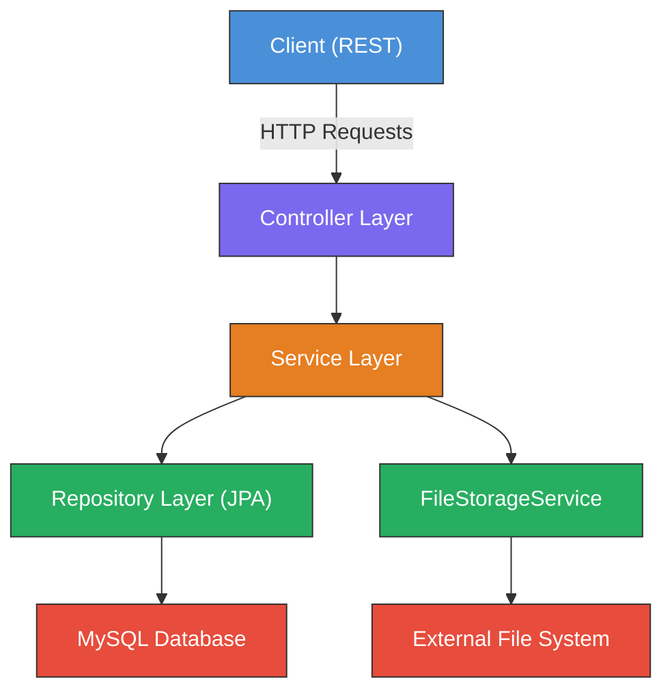
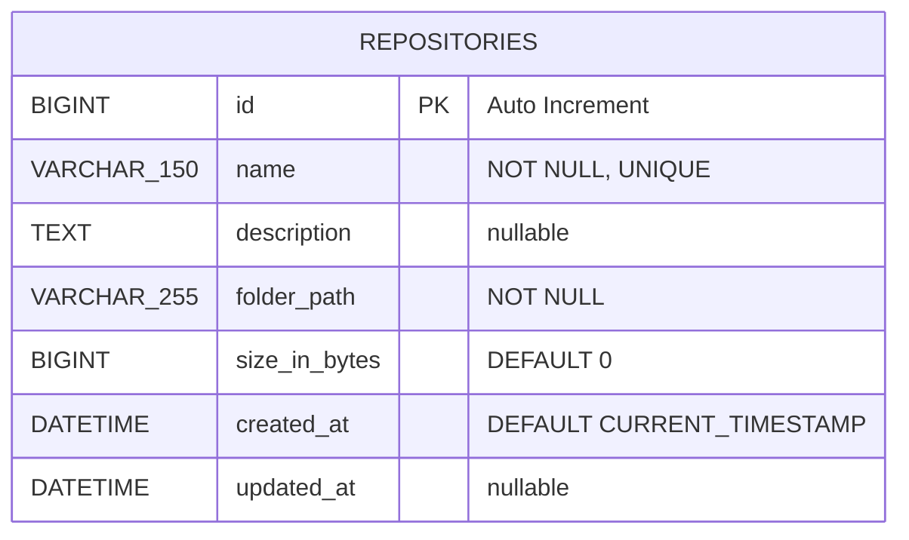
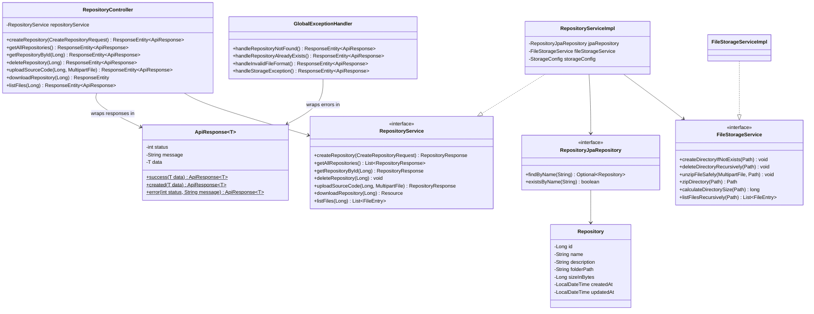
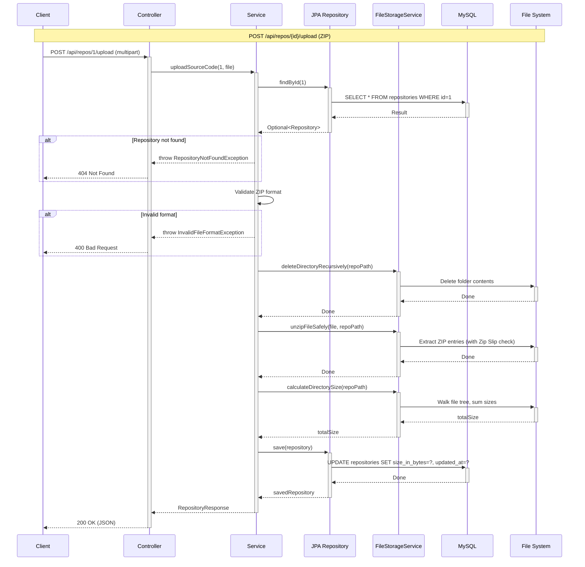
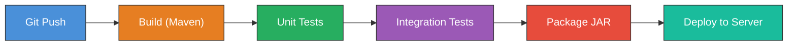
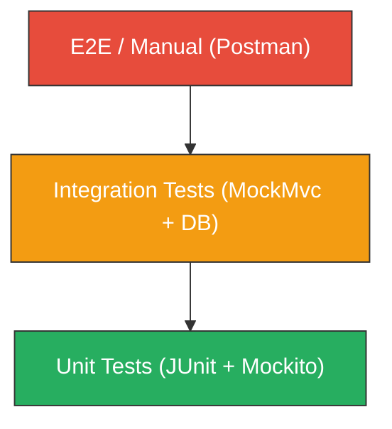
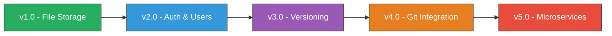
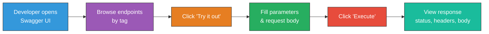

# 📦 CodeVault — Complete Project Plan

> **Project**: CodeVault – Source Code Storage Server  
> **Version**: 1.0 (No Authentication, No Versioning)  
> **Date**: 2026-03-02  
> **Status**: Planning Phase  

---

## Table of Contents

1. [Project Overview & Objectives](#1-project-overview--objectives)
2. [Scope & Key Components](#2-scope--key-components)
3. [Requirement Analysis](#3-requirement-analysis)
4. [Database Design](#4-database-design)
5. [Project Structure Design](#5-project-structure-design)
6. [API Specification](#6-api-specification)
7. [Component & Service Design](#7-component--service-design)
8. [Workflow Design](#8-workflow-design)
9. [Tools, Frameworks & Technologies](#9-tools-frameworks--technologies)
10. [Testing Strategy](#10-testing-strategy)
11. [Deployment Plan](#11-deployment-plan)
12. [Future Extensibility Roadmap](#12-future-extensibility-roadmap)
13. [Swagger / OpenAPI Documentation](#13-swagger--openapi-documentation)

---

## 1. Project Overview & Objectives

### 1.1 What is CodeVault?

CodeVault is a **RESTful backend service** built with **Spring Boot** that allows users to store and manage source code repositories in a simplified, file-based manner. It acts as a lightweight source code storage server — think of it as a minimal precursor to platforms like GitHub or GitLab, focused purely on **storage and retrieval**.

### 1.2 Main Objectives

| # | Objective | Description |
|---|-----------|-------------|
| 1 | **Repository CRUD** | Create, read, list, and delete source code repositories via REST API |
| 2 | **ZIP-based Upload** | Accept source code as `.zip` archives, extract and store on the file system |
| 3 | **ZIP-based Download** | Compress and stream repository content back to clients |
| 4 | **File Listing** | Recursively list all files/directories within a repository |
| 5 | **Metadata Management** | Store repository metadata (name, description, size, timestamps) in MySQL |
| 6 | **External File Storage** | Store actual source code on an external file system, NOT in the database or project directory |
| 7 | **Security** | Protect against Zip Slip and path traversal attacks |
| 8 | **Extensibility** | Design architecture to allow future addition of auth, versioning, Git integration, etc. |

### 1.3 Explicit Exclusions (v1.0)

> [!IMPORTANT]
> The following features are **intentionally excluded** from v1.0 to keep the scope focused:

- ❌ Authentication & Authorization (no Spring Security, no JWT)
- ❌ User management / multi-tenancy
- ❌ Version control / commit history
- ❌ Git integration (no JGit, no libgit2)
- ❌ Docker containerization (initial version)
- ❌ Frontend / UI

---

## 2. Scope & Key Components

### 2.1 System Scope



### 2.2 Key Components

| Component | Responsibility |
|-----------|---------------|
| **Controller Layer** | Handle HTTP requests, validate input, delegate to services |
| **Service Layer** | Business logic orchestration (repo operations + file operations) |
| **Repository Layer (JPA)** | Database CRUD operations via Spring Data JPA |
| **FileStorageService** | All file system operations (create, delete, zip, unzip, list, size) |
| **Exception Handling** | Global `@ControllerAdvice` with custom exceptions and proper HTTP status codes |
| **Configuration** | Externalized storage path, database settings via `application.yml` |

---

## 3. Requirement Analysis

### 3.1 Functional Requirements

#### FR-01: Repository Management

| ID | Requirement | Priority |
|----|-------------|----------|
| FR-01.1 | Create a new repository with a unique name and optional description | **Must** |
| FR-01.2 | List all repositories with metadata | **Must** |
| FR-01.3 | Retrieve single repository details by ID | **Must** |
| FR-01.4 | Delete a repository (both database record AND file system folder) | **Must** |
| FR-01.5 | Validate repository name uniqueness on creation | **Must** |
| FR-01.6 | Auto-generate physical folder on creation using `repoId` | **Must** |

#### FR-02: Source Code Upload

| ID | Requirement | Priority |
|----|-------------|----------|
| FR-02.1 | Accept multipart `.zip` file upload for a specific repository | **Must** |
| FR-02.2 | Validate that uploaded file is in ZIP format | **Must** |
| FR-02.3 | Delete existing folder content before extracting new upload | **Must** |
| FR-02.4 | Safely extract ZIP content into repository folder | **Must** |
| FR-02.5 | Calculate and update `size_in_bytes` after upload | **Must** |
| FR-02.6 | Update `updated_at` timestamp after upload | **Must** |

#### FR-03: Source Code Download

| ID | Requirement | Priority |
|----|-------------|----------|
| FR-03.1 | Compress repository folder into a ZIP archive | **Must** |
| FR-03.2 | Stream ZIP file as HTTP response with `Content-Disposition: attachment` | **Must** |
| FR-03.3 | Clean up temporary ZIP file after sending | **Must** |

#### FR-04: File Listing

| ID | Requirement | Priority |
|----|-------------|----------|
| FR-04.1 | Recursively scan and list all files/directories in a repository | **Must** |
| FR-04.2 | Return structured JSON with name, type (file/directory), and path | **Must** |
| FR-04.3 | No file metadata is stored in the database (scan live from file system) | **Must** |

### 3.2 Non-Functional Requirements

| ID | Requirement | Category | Description |
|----|-------------|----------|-------------|
| NFR-01 | **Security** | Security | Protect against Zip Slip vulnerability |
| NFR-02 | **Security** | Security | Prevent path traversal attacks during ZIP extraction |
| NFR-03 | **Security** | Security | Reject absolute paths inside ZIP archives |
| NFR-04 | **Performance** | Performance | Handle large file uploads properly (streaming, not full in-memory) |
| NFR-05 | **Maintainability** | Architecture | Follow SOLID principles |
| NFR-06 | **Configurability** | Configuration | Externalize storage path — no hardcoding |
| NFR-07 | **Separation** | Architecture | Source code files stored outside the Spring Boot project directory |
| NFR-08 | **Separation** | Architecture | No file content stored in the database |
| NFR-09 | **Extensibility** | Architecture | Architecture must support future feature additions (auth, versioning, etc.) |
| NFR-10 | **Error Handling** | Reliability | Consistent, structured error responses using `@ControllerAdvice` |

### 3.3 Constraints

| Constraint | Detail |
|------------|--------|
| Language | Java 21 |
| Framework | Spring Boot 4.0.3 |
| Database | MySQL |
| File Format | Only `.zip` uploads accepted |
| Storage | External file system directory (configurable) |
| No Auth | No authentication or authorization |
| No Versioning | Single version per repository — upload replaces content |

---

## 4. Database Design

### 4.1 Entity-Relationship Diagram



### 4.2 Table Definition: `repositories`

| Column | Type | Constraints | Description |
|--------|------|-------------|-------------|
| `id` | `BIGINT` | `PRIMARY KEY`, `AUTO_INCREMENT` | Unique identifier |
| `name` | `VARCHAR(150)` | `NOT NULL`, `UNIQUE` | Human-readable repository name |
| `description` | `TEXT` | `nullable` | Optional description of the repository |
| `folder_path` | `VARCHAR(255)` | `NOT NULL` | Absolute path to physical storage folder |
| `size_in_bytes` | `BIGINT` | `DEFAULT 0` | Total size of stored files in bytes |
| `created_at` | `DATETIME` | `DEFAULT CURRENT_TIMESTAMP` | Record creation timestamp |
| `updated_at` | `DATETIME` | `nullable` | Last modification timestamp (set on upload) |

### 4.3 DDL Script

```sql
CREATE DATABASE IF NOT EXISTS codevault_db
    CHARACTER SET utf8mb4
    COLLATE utf8mb4_unicode_ci;

USE codevault_db;

CREATE TABLE repositories (
    id              BIGINT          AUTO_INCREMENT PRIMARY KEY,
    name            VARCHAR(150)    NOT NULL UNIQUE,
    description     TEXT            NULL,
    folder_path     VARCHAR(255)    NOT NULL,
    size_in_bytes   BIGINT          DEFAULT 0,
    created_at      DATETIME        DEFAULT CURRENT_TIMESTAMP,
    updated_at      DATETIME        NULL,

    INDEX idx_repositories_name (name)
) ENGINE=InnoDB DEFAULT CHARSET=utf8mb4 COLLATE=utf8mb4_unicode_ci;
```

### 4.4 Normalization Analysis

| Normal Form | Status | Justification |
|-------------|--------|---------------|
| **1NF** | ✅ | All columns contain atomic values; no repeating groups |
| **2NF** | ✅ | Single-column PK — no partial dependencies possible |
| **3NF** | ✅ | No transitive dependencies; all non-key columns depend directly on `id` |

> [!NOTE]
> The current design uses a **single table** since v1.0 has no users, no versions, and no file-level metadata in the database. This is intentionally minimal and will be normalized further when new entities are introduced in future versions (e.g., `users`, `versions`, `tags`).

### 4.5 JPA Entity Mapping

```java
@Entity
@Table(name = "repositories")
@Getter @Setter
@NoArgsConstructor @AllArgsConstructor
@Builder
public class Repository {

    @Id
    @GeneratedValue(strategy = GenerationType.IDENTITY)
    private Long id;

    @Column(name = "name", length = 150, nullable = false, unique = true)
    private String name;

    @Column(name = "description", columnDefinition = "TEXT")
    private String description;

    @Column(name = "folder_path", length = 255, nullable = false)
    private String folderPath;

    @Column(name = "size_in_bytes")
    @Builder.Default
    private Long sizeInBytes = 0L;

    @Column(name = "created_at", updatable = false)
    @CreationTimestamp
    private LocalDateTime createdAt;

    @Column(name = "updated_at")
    @UpdateTimestamp
    private LocalDateTime updatedAt;
}
```

---

## 5. Project Structure Design

### 5.1 Package & Folder Structure

```
CodeVault/
├── pom.xml
├── src/
│   ├── main/
│   │   ├── java/com/build/CodeVault/
│   │   │   ├── CodeVaultApplication.java          # Main entry point
│   │   │   │
│   │   │   ├── config/
│   │   │   │   ├── StorageConfig.java             # Storage path configuration
│   │   │   │   └── SwaggerConfig.java             # OpenAPI / Swagger UI configuration
│   │   │   │
│   │   │   ├── controller/
│   │   │   │   └── RepositoryController.java      # REST API endpoints
│   │   │   │
│   │   │   ├── dto/
│   │   │   │   ├── ApiResponse.java                # Generic response wrapper
│   │   │   │   ├── request/
│   │   │   │   │   └── CreateRepositoryRequest.java
│   │   │   │   └── response/
│   │   │   │       ├── RepositoryResponse.java
│   │   │   │       ├── FileEntry.java             # File listing DTO
│   │   │   │       └── ErrorResponse.java
│   │   │   │
│   │   │   ├── entity/
│   │   │   │   └── Repository.java                # JPA entity
│   │   │   │
│   │   │   ├── exception/
│   │   │   │   ├── GlobalExceptionHandler.java    # @ControllerAdvice
│   │   │   │   ├── RepositoryNotFoundException.java
│   │   │   │   ├── RepositoryAlreadyExistsException.java
│   │   │   │   ├── InvalidFileFormatException.java
│   │   │   │   └── StorageException.java
│   │   │   │
│   │   │   ├── repository/
│   │   │   │   └── RepositoryJpaRepository.java   # Spring Data JPA
│   │   │   │
│   │   │   └── service/
│   │   │       ├── RepositoryService.java         # Business logic
│   │   │       ├── RepositoryServiceImpl.java
│   │   │       ├── FileStorageService.java        # File operations interface
│   │   │       └── FileStorageServiceImpl.java
│   │   │
│   │   └── resources/
│   │       ├── application.yml                    # Main config
│   │       └── application-dev.yml                # Dev profile config
│   │
│   └── test/
│       └── java/com/build/CodeVault/
│           ├── CodeVaultApplicationTests.java
│           ├── controller/
│           │   └── RepositoryControllerTest.java
│           ├── service/
│           │   ├── RepositoryServiceTest.java
│           │   └── FileStorageServiceTest.java
│           └── repository/
│               └── RepositoryJpaRepositoryTest.java
│
├── decription_project.md
└── docs/                                           # Project documentation
    └── CodeVault_Project_Plan.md
```

### 5.2 Layer Responsibility Matrix

| Layer | Package | Responsibility | Depends On |
|-------|---------|---------------|------------|
| **Controller** | `controller` | HTTP request handling, input validation, response mapping | Service |
| **DTO** | `dto.request`, `dto.response` | Data transfer objects for API input/output | — |
| **Service** | `service` | Business logic, orchestration | Repository (JPA), FileStorageService |
| **Repository** | `repository` | Database CRUD via Spring Data JPA | Entity |
| **Entity** | `entity` | JPA entity mapping | — |
| **Exception** | `exception` | Custom exceptions + global handler | — |
| **Config** | `config` | Configuration beans | — |

### 5.3 Key Design Decisions

> [!TIP]
> **Why `ApiResponse<T>` wrapper?**  
> All API endpoints (except file download) return responses wrapped in a generic `ApiResponse<T>` object. This ensures a **consistent JSON structure** across every endpoint, making it easier for frontend clients and API consumers to parse responses uniformly — whether the call succeeded or failed.

> [!TIP]
> **Why interfaces for services?**  
> Both `RepositoryService` and `FileStorageService` should be defined as **interfaces** with separate implementation classes. This follows the **Dependency Inversion Principle (DIP)** and makes future changes (e.g., swapping file storage for S3) seamless.

> [!TIP]
> **Why DTOs instead of exposing entities?**  
> DTOs decouple the API contract from the database schema. This prevents accidental exposure of internal fields and allows the API to evolve independently of the data model.

### 5.4 `ApiResponse<T>` — Standard Response Wrapper

All JSON responses are wrapped in a unified `ApiResponse<T>` generic class:

```java
@Getter @Setter
@NoArgsConstructor @AllArgsConstructor
@Builder
public class ApiResponse<T> {

    private int status;       // HTTP status code (e.g., 200, 201, 404)
    private String message;   // Human-readable message (e.g., "Repository created successfully")
    private T data;           // Payload — generic type (RepositoryResponse, List<FileEntry>, etc.)

    // ── Factory methods for convenience ──

    public static <T> ApiResponse<T> success(T data) {
        return ApiResponse.<T>builder()
                .status(200)
                .message("Success")
                .data(data)
                .build();
    }

    public static <T> ApiResponse<T> created(T data) {
        return ApiResponse.<T>builder()
                .status(201)
                .message("Created successfully")
                .data(data)
                .build();
    }

    public static <T> ApiResponse<T> error(int status, String message) {
        return ApiResponse.<T>builder()
                .status(status)
                .message(message)
                .data(null)
                .build();
    }
}
```

**JSON structure:**
```json
{
  "status": 200,
  "message": "Success",
  "data": { /* payload here */ }
}
```

---

## 6. API Specification

### 6.1 Endpoint Summary

| Method | Endpoint | Description | Request Body | Response |
|--------|----------|-------------|-------------|----------|
| `POST` | `/api/repos` | Create a new repository | JSON body | `201 Created` |
| `GET` | `/api/repos` | List all repositories | — | `200 OK` |
| `GET` | `/api/repos/{id}` | Get repository details | — | `200 OK` |
| `DELETE` | `/api/repos/{id}` | Delete repository | — | `204 No Content` |
| `POST` | `/api/repos/{id}/upload` | Upload source code (ZIP) | Multipart file | `200 OK` |
| `GET` | `/api/repos/{id}/download` | Download repository as ZIP | — | ZIP stream |
| `GET` | `/api/repos/{id}/files` | List files in repository | — | `200 OK` |

### 6.2 Detailed API Contracts

#### `POST /api/repos` — Create Repository

**Request:**
```json
{
  "name": "my-project",
  "description": "A sample Spring Boot application"
}
```

**Validation:**
- `name`: required, max 150 chars, unique across all repositories
- `description`: optional

**Success Response** `201 Created`:
```json
{
  "status": 201,
  "message": "Repository created successfully",
  "data": {
    "id": 1,
    "name": "my-project",
    "description": "A sample Spring Boot application",
    "folderPath": "D:/codevault-storage/repos/1",
    "sizeInBytes": 0,
    "createdAt": "2026-03-02T23:00:00",
    "updatedAt": null
  }
}
```

**Error Responses:**

| Status | Condition | Body |
|--------|-----------|------|
| `400` | Missing or invalid `name` | `{"status": 400, "message": "Name is required", "data": null}` |
| `409` | Duplicate `name` | `{"status": 409, "message": "Repository 'my-project' already exists", "data": null}` |

---

#### `GET /api/repos` — List All Repositories

**Success Response** `200 OK`:
```json
{
  "status": 200,
  "message": "Success",
  "data": [
    {
      "id": 1,
      "name": "my-project",
      "description": "A sample Spring Boot application",
      "folderPath": "D:/codevault-storage/repos/1",
      "sizeInBytes": 204800,
      "createdAt": "2026-03-02T23:00:00",
      "updatedAt": "2026-03-02T23:05:00"
    }
  ]
}
```

---

#### `GET /api/repos/{id}` — Get Repository Details

**Success Response** `200 OK`: Same structure as single item in list.

**Error Response:**

| Status | Condition |
|--------|-----------|
| `404` | Repository with given `id` not found |

---

#### `DELETE /api/repos/{id}` — Delete Repository

**Process:**
1. Verify repository exists → `404` if not
2. Delete physical folder recursively from file system
3. Delete database record

**Success Response** `204 No Content` (empty body)

---

#### `POST /api/repos/{id}/upload` — Upload Source Code

**Request:** `multipart/form-data` with a single file field (`.zip` only)

**Process:**
1. Validate repository exists → `404` if not
2. Validate file is ZIP format → `400` if not
3. Delete existing content in repository folder
4. Safely extract ZIP to repository folder (with Zip Slip protection)
5. Calculate total directory size
6. Update `size_in_bytes` and `updated_at`

**Success Response** `200 OK`:
```json
{
  "status": 200,
  "message": "Source code uploaded successfully",
  "data": {
    "id": 1,
    "name": "my-project",
    "description": "A sample Spring Boot application",
    "folderPath": "D:/codevault-storage/repos/1",
    "sizeInBytes": 204800,
    "createdAt": "2026-03-02T23:00:00",
    "updatedAt": "2026-03-02T23:10:00"
  }
}
```

**Error Responses:**

| Status | Condition |
|--------|-----------|
| `400` | File is not a valid ZIP archive |
| `404` | Repository not found |
| `500` | Storage/extraction error |

---

#### `GET /api/repos/{id}/download` — Download Repository

**Response:**
- `Content-Type: application/zip`
- `Content-Disposition: attachment; filename="my-project.zip"`
- Body: streamed ZIP bytes

**Error Responses:**

| Status | Condition |
|--------|-----------|
| `404` | Repository not found |
| `500` | Error creating ZIP archive |

---

#### `GET /api/repos/{id}/files` — List Files

**Success Response** `200 OK`:
```json
{
  "status": 200,
  "message": "Success",
  "data": [
    {
      "name": "src",
      "type": "directory",
      "path": "src"
    },
    {
      "name": "pom.xml",
      "type": "file",
      "path": "pom.xml"
    },
    {
      "name": "Application.java",
      "type": "file",
      "path": "src/main/java/Application.java"
    }
  ]
}
```

---

## 7. Component & Service Design

### 7.1 Class Diagram



### 7.2 FileStorageService Methods Detail

| Method | Input | Output | Description |
|--------|-------|--------|-------------|
| `createDirectoryIfNotExists` | `Path dirPath` | `void` | Creates directory (and parents) if not present |
| `deleteDirectoryRecursively` | `Path dirPath` | `void` | Recursively deletes folder and all contents |
| `unzipFileSafely` | `MultipartFile file, Path targetDir` | `void` | Extracts ZIP with Zip Slip protection |
| `zipDirectory` | `Path sourceDir` | `Path` | Compresses directory into temp ZIP file |
| `calculateDirectorySize` | `Path dirPath` | `long` | Sums sizes of all files recursively |
| `listFilesRecursively` | `Path dirPath` | `List<FileEntry>` | Returns structured file/dir listing |

### 7.3 Security: Zip Slip Protection

> [!CAUTION]
> **Zip Slip** is a critical vulnerability where malicious ZIP entries contain path traversal sequences (e.g., `../../etc/passwd`), allowing file writes outside the intended target directory.

**Required validation in `unzipFileSafely`:**

```java
// For each entry in the ZIP:
Path resolvedPath = targetDir.resolve(entry.getName()).normalize();

if (!resolvedPath.startsWith(targetDir.normalize())) {
    throw new StorageException(
        "Zip Slip detected: entry '" + entry.getName() + "' escapes target directory"
    );
}
```

---

## 8. Workflow Design

### 8.1 Development Workflow


#### Phase 1: Project Setup (Day 1)
- [x] Initialize Spring Boot project with dependencies
- [ ] Configure `application.yml` with MySQL and storage settings
- [ ] Create `StorageConfig` class for externalized storage path
- [ ] Set up MySQL database and schema
- [ ] Verify application starts successfully

#### Phase 2: Entity & Database Layer (Day 1–2)
- [ ] Create `Repository` JPA entity with all fields
- [ ] Validate JPA auto-creates/updates table via `spring.jpa.hibernate.ddl-auto`
- [ ] Test entity mapping manually

#### Phase 3: Repository Layer (Day 2)
- [ ] Create `RepositoryJpaRepository` interface (extends `JpaRepository`)
- [ ] Add `findByName` and `existsByName` query methods
- [ ] Write integration tests

#### Phase 4: FileStorageService (Day 2–3)
- [ ] Define `FileStorageService` interface
- [ ] Implement `FileStorageServiceImpl` with all 6 methods
- [ ] Implement Zip Slip protection in `unzipFileSafely`
- [ ] Write unit tests for all file operations

#### Phase 5: Business Service Layer (Day 3–4)
- [ ] Define `RepositoryService` interface
- [ ] Implement `RepositoryServiceImpl` with all business logic
- [ ] Create DTOs (`ApiResponse`, `CreateRepositoryRequest`, `RepositoryResponse`, `FileEntry`)
- [ ] Write unit tests with mocked dependencies

#### Phase 6: Controller Layer (Day 4–5)
- [ ] Create `RepositoryController` with all 7 endpoints
- [ ] Add input validation annotations (`@Valid`, `@NotBlank`, etc.)
- [ ] Write integration tests using `MockMvc`

#### Phase 7: Exception Handling (Day 5)
- [ ] Create custom exception classes (4 total)
- [ ] Implement `GlobalExceptionHandler` with `@ControllerAdvice`
- [ ] Create `ErrorResponse` DTO
- [ ] Map exceptions to proper HTTP status codes

#### Phase 8: Testing & QA (Day 5–6)
- [ ] Unit tests for all service methods
- [ ] Integration tests for all API endpoints
- [ ] Manual testing via Postman / Insomnia
- [ ] Edge case testing (large files, empty ZIP, invalid formats)

#### Phase 9: Swagger & Documentation (Day 6)
- [ ] Add `springdoc-openapi-starter-webmvc-ui` dependency to `pom.xml`
- [ ] Create `SwaggerConfig.java` with API metadata (title, version, description)
- [ ] Add `@Tag` annotations to `RepositoryController`
- [ ] Add `@Operation` and `@ApiResponse` annotations to each endpoint
- [ ] Verify Swagger UI at `http://localhost:8080/swagger-ui.html`
- [ ] Verify JSON spec at `http://localhost:8080/api-docs`
- [ ] README with setup instructions
- [ ] Configuration guide

### 8.2 Request Processing Flow



### 8.3 CI/CD Pipeline (Recommended)



| Stage | Tool | Command |
|-------|------|---------|
| Build | Maven | `./mvnw clean compile` |
| Unit Test | JUnit 5 + Mockito | `./mvnw test` |
| Integration Test | Spring Boot Test | `./mvnw verify` |
| Package | Maven | `./mvnw package -DskipTests` |
| Deploy | Manual / Script | `java -jar target/CodeVault-0.0.1-SNAPSHOT.jar` |

---

## 9. Tools, Frameworks & Technologies

### 9.1 Core Technology Stack

| Category | Technology | Version | Purpose |
|----------|-----------|---------|---------|
| **Language** | Java | 21 | Primary language |
| **Framework** | Spring Boot | 4.0.3 | Application framework |
| **Web** | Spring Web MVC | (via starter) | REST API handling |
| **Data** | Spring Data JPA / Hibernate | (via starter) | ORM & database access |
| **Validation** | Spring Validation (Jakarta) | (via starter) | Input validation |
| **Database** | MySQL | 8.x+ | Relational data storage |
| **Build** | Apache Maven | 3.9+ | Build & dependency management |

### 9.2 Libraries & Utilities

| Library | Purpose | Already in POM? |
|---------|---------|:-:|
| **Lombok** | Reduce boilerplate (getters, setters, builders) | ✅ |
| **MySQL Connector/J** | JDBC driver for MySQL | ✅ |
| **Spring Boot DevTools** | Hot-reload during development | ✅ |
| Apache Commons IO | Utility methods for file I/O | ❌ (Recommended) |
| **Springdoc OpenAPI** | Auto-generated Swagger UI for API docs | ❌ → **Required** |

### 9.3 Development Tools

| Tool | Purpose |
|------|---------|
| **IntelliJ IDEA / VS Code** | IDE |
| **Postman / Insomnia** | API testing |
| **MySQL Workbench / DBeaver** | Database management |
| **Git** | Version control |
| **Maven Wrapper** | Consistent Maven version across environments |

### 9.4 Testing Frameworks

| Framework | Purpose | Scope |
|-----------|---------|-------|
| **JUnit 5** | Unit & integration testing | All layers |
| **Mockito** | Mocking dependencies | Service layer |
| **Spring Boot Test** | Application context testing | Integration |
| **MockMvc** | Controller testing without server | Controller layer |
| **H2 Database** (optional) | In-memory DB for tests | Test profile |

### 9.5 Recommended `application.yml` Configuration

```yaml
spring:
  application:
    name: CodeVault

  datasource:
    url: jdbc:mysql://localhost:3306/codevault_db?useSSL=false&serverTimezone=UTC&allowPublicKeyRetrieval=true
    username: root
    password: your_password
    driver-class-name: com.mysql.cj.jdbc.Driver

  jpa:
    hibernate:
      ddl-auto: update
    show-sql: true
    properties:
      hibernate:
        dialect: org.hibernate.dialect.MySQLDialect
        format_sql: true

  servlet:
    multipart:
      max-file-size: 100MB
      max-request-size: 100MB

# Custom application config
storage:
  location: D:/codevault-storage

server:
  port: 8080

# Swagger / OpenAPI
springdoc:
  api-docs:
    path: /api-docs              # JSON spec endpoint
  swagger-ui:
    path: /swagger-ui.html       # Swagger UI page
    operations-sorter: method    # Sort by HTTP method
    tags-sorter: alpha           # Sort tags alphabetically
```

---

## 10. Testing Strategy

### 10.1 Testing Pyramid



### 10.2 Test Coverage Plan

| Layer | Test Type | What to Test |
|-------|-----------|-------------|
| **Entity** | Unit | JPA annotations, builder pattern |
| **Repository** | Integration | Custom queries (`findByName`, `existsByName`) |
| **FileStorageService** | Unit | All 6 methods, Zip Slip protection, edge cases |
| **RepositoryService** | Unit (mocked) | Business logic, error conditions, orchestration |
| **Controller** | Integration (MockMvc) | All 7 endpoints, request validation, error responses |
| **Exception Handler** | Integration | Correct HTTP status codes and error body format |

### 10.3 Key Test Scenarios

| Scenario | Expected Result |
|----------|----------------|
| Create repo with unique name | `201 Created` + metadata |
| Create repo with duplicate name | `409 Conflict` |
| Upload valid ZIP | File extracted, size updated, `200 OK` |
| Upload non-ZIP file | `400 Bad Request` |
| Upload to non-existent repo | `404 Not Found` |
| Download existing repo | ZIP streamed, `Content-Disposition` header |
| Download empty repo | Empty ZIP or error |
| Delete repo | Folder deleted + DB record deleted, `204 No Content` |
| List files of repo | JSON array of file/dir entries |
| ZIP with path traversal | Rejected with `StorageException` |

---

## 11. Deployment Plan

### 11.1 Prerequisites

| Requirement | Detail |
|-------------|--------|
| Java | JDK 21 installed |
| MySQL | MySQL 8.x+ running |
| Storage | External directory created (e.g., `D:/codevault-storage`) |
| Permissions | Application user has read/write access to storage directory |

### 11.2 Deployment Steps

```
1. Build the JAR
   ./mvnw clean package -DskipTests

2. Create the database
   mysql -u root -p < docs/schema.sql

3. Configure application
   Edit application.yml or use environment variables:
   - SPRING_DATASOURCE_URL
   - SPRING_DATASOURCE_USERNAME
   - SPRING_DATASOURCE_PASSWORD
   - STORAGE_LOCATION

4. Create storage directory
   mkdir -p /var/codevault-storage/repos   (Linux)
   mkdir D:\codevault-storage\repos        (Windows)

5. Run the application
   java -jar target/CodeVault-0.0.1-SNAPSHOT.jar

6. Verify
   curl http://localhost:8080/api/repos
   → Expected: []
```

### 11.3 Environment Configuration Matrix

| Property | Dev | Staging | Production |
|----------|-----|---------|------------|
| `spring.datasource.url` | `localhost:3306/codevault_db` | `staging-db:3306/codevault_db` | `prod-db:3306/codevault_db` |
| `spring.jpa.hibernate.ddl-auto` | `update` | `validate` | `validate` |
| `spring.jpa.show-sql` | `true` | `false` | `false` |
| `storage.location` | `D:/codevault-storage` | `/var/codevault-storage` | `/var/codevault-storage` |
| `multipart.max-file-size` | `100MB` | `100MB` | `500MB` |

---

## 12. Future Extensibility Roadmap

### 12.1 Planned Evolution Path



| Version | Features | New Technologies |
|---------|----------|-----------------|
| **v1.0** (Current) | Repository CRUD, ZIP upload/download, file listing | Spring Boot, MySQL, JPA |
| **v2.0** | Authentication, user management, access control | Spring Security, JWT, `users` table |
| **v3.0** | Version history, commit-like snapshots | Additional `versions` table, diff engine |
| **v4.0** | Git integration, clone/push support | JGit, SSH key management |
| **v5.0** | Microservices decomposition, CI/CD features | Docker, Kubernetes, RabbitMQ/Kafka |

### 12.2 Architectural Decisions Supporting Extensibility

| Decision | Future Benefit |
|----------|---------------|
| Interface-based services | Swap implementations without changing consumers |
| DTO layer separation | API contract evolves independently of data model |
| External storage path config | Replace local disk with S3, MinIO, etc. |
| Global exception handler | Add new exception types without changing controllers |
| Single `repositories` table | Add relations (`users`, `versions`) without altering core schema |

---

> [!NOTE]
> **This document serves as the single source of truth** for the CodeVault v1.0 development effort. All team members should refer to this plan for architecture decisions, API contracts, and implementation priorities. Update this document as requirements evolve.

---

## 13. Swagger / OpenAPI Documentation

### 13.1 Why Swagger?

> [!TIP]
> Swagger UI provides an **interactive, browser-based API explorer** that lets developers and testers try out every endpoint without needing Postman or cURL. It auto-generates documentation from your code, so it's always up-to-date.

| Benefit | Description |
|---------|-------------|
| **Interactive Testing** | Call any endpoint directly from the browser — fill in parameters, upload files, see responses |
| **Auto-Generated** | Documentation is derived from your controller code and annotations — no manual sync needed |
| **Always Up-to-Date** | Changes to endpoints, DTOs, or validation rules are reflected automatically |
| **Team Onboarding** | New developers can understand the entire API surface in minutes |
| **Client Code Generation** | Export the OpenAPI JSON spec to generate client SDKs in any language |

### 13.2 Maven Dependency

Add the following to `pom.xml` inside `<dependencies>`:

```xml
<!-- Swagger / OpenAPI 3 -->
<dependency>
    <groupId>org.springdoc</groupId>
    <artifactId>springdoc-openapi-starter-webmvc-ui</artifactId>
    <version>2.8.6</version>
</dependency>
```

> [!NOTE]
> `springdoc-openapi-starter-webmvc-ui` includes both the **OpenAPI JSON spec** generation and the **Swagger UI** web interface. No additional dependencies are needed.

### 13.3 SwaggerConfig.java

```java
package com.build.CodeVault.config;

import io.swagger.v3.oas.models.OpenAPI;
import io.swagger.v3.oas.models.info.Contact;
import io.swagger.v3.oas.models.info.Info;
import io.swagger.v3.oas.models.info.License;
import io.swagger.v3.oas.models.servers.Server;
import org.springframework.context.annotation.Bean;
import org.springframework.context.annotation.Configuration;

import java.util.List;

@Configuration
public class SwaggerConfig {

    @Bean
    public OpenAPI codeVaultOpenAPI() {
        return new OpenAPI()
                .info(new Info()
                        .title("CodeVault API")
                        .version("1.0.0")
                        .description("RESTful API for CodeVault — Source Code Storage Server. "
                                + "Manage repositories, upload/download source code as ZIP archives, "
                                + "and browse repository file structures.")
                        .contact(new Contact()
                                .name("CodeVault Team")
                                .email("team@codevault.dev"))
                        .license(new License()
                                .name("MIT License")
                                .url("https://opensource.org/licenses/MIT")))
                .servers(List.of(
                        new Server().url("http://localhost:8080").description("Local Dev")
                ));
    }
}
```

### 13.4 Controller Annotations Example

Add Swagger annotations to `RepositoryController` for rich, interactive documentation:

```java
import io.swagger.v3.oas.annotations.Operation;
import io.swagger.v3.oas.annotations.Parameter;
import io.swagger.v3.oas.annotations.responses.ApiResponse;
import io.swagger.v3.oas.annotations.responses.ApiResponses;
import io.swagger.v3.oas.annotations.tags.Tag;

@RestController
@RequestMapping("/api/repos")
@Tag(name = "Repository", description = "Repository management — CRUD, upload, download, file listing")
public class RepositoryController {

    // ── Create ──

    @Operation(
        summary = "Create a new repository",
        description = "Creates a new repository with a unique name. "
                    + "A physical folder is auto-created on the file system."
    )
    @ApiResponses({
        @ApiResponse(responseCode = "201", description = "Repository created successfully"),
        @ApiResponse(responseCode = "400", description = "Invalid request body"),
        @ApiResponse(responseCode = "409", description = "Repository name already exists")
    })
    @PostMapping
    public ResponseEntity<com.build.CodeVault.dto.ApiResponse<RepositoryResponse>>
            createRepository(@Valid @RequestBody CreateRepositoryRequest request) { ... }

    // ── List All ──

    @Operation(summary = "List all repositories", description = "Returns metadata for every repository.")
    @GetMapping
    public ResponseEntity<com.build.CodeVault.dto.ApiResponse<List<RepositoryResponse>>>
            getAllRepositories() { ... }

    // ── Get by ID ──

    @Operation(summary = "Get repository details", description = "Returns metadata for a single repository by ID.")
    @ApiResponses({
        @ApiResponse(responseCode = "200", description = "Repository found"),
        @ApiResponse(responseCode = "404", description = "Repository not found")
    })
    @GetMapping("/{id}")
    public ResponseEntity<com.build.CodeVault.dto.ApiResponse<RepositoryResponse>>
            getRepositoryById(@Parameter(description = "Repository ID") @PathVariable Long id) { ... }

    // ── Delete ──

    @Operation(summary = "Delete a repository", description = "Deletes the DB record and physical folder.")
    @DeleteMapping("/{id}")
    public ResponseEntity<com.build.CodeVault.dto.ApiResponse<Void>>
            deleteRepository(@Parameter(description = "Repository ID") @PathVariable Long id) { ... }

    // ── Upload ──

    @Operation(
        summary = "Upload source code (ZIP)",
        description = "Replaces existing content with the uploaded ZIP archive. "
                    + "Only .zip files are accepted."
    )
    @ApiResponses({
        @ApiResponse(responseCode = "200", description = "Source code uploaded successfully"),
        @ApiResponse(responseCode = "400", description = "Invalid file format (not ZIP)"),
        @ApiResponse(responseCode = "404", description = "Repository not found")
    })
    @PostMapping(value = "/{id}/upload", consumes = MediaType.MULTIPART_FORM_DATA_VALUE)
    public ResponseEntity<com.build.CodeVault.dto.ApiResponse<RepositoryResponse>>
            uploadSourceCode(
                @Parameter(description = "Repository ID") @PathVariable Long id,
                @Parameter(description = "ZIP file containing source code") @RequestParam("file") MultipartFile file
            ) { ... }

    // ── Download ──

    @Operation(summary = "Download repository as ZIP", description = "Streams the repository content as a ZIP archive.")
    @GetMapping("/{id}/download")
    public ResponseEntity<Resource>
            downloadRepository(@Parameter(description = "Repository ID") @PathVariable Long id) { ... }

    // ── List Files ──

    @Operation(summary = "List files in repository", description = "Recursively lists all files and directories.")
    @GetMapping("/{id}/files")
    public ResponseEntity<com.build.CodeVault.dto.ApiResponse<List<FileEntry>>>
            listFiles(@Parameter(description = "Repository ID") @PathVariable Long id) { ... }
}
```

### 13.5 Access URLs

Once the application is running, access the documentation at:

| Resource | URL | Format |
|----------|-----|--------|
| **Swagger UI** | [http://localhost:8080/swagger-ui.html](http://localhost:8080/swagger-ui.html) | Interactive web page |
| **OpenAPI JSON** | [http://localhost:8080/api-docs](http://localhost:8080/api-docs) | JSON spec (for code generation) |
| **OpenAPI YAML** | [http://localhost:8080/api-docs.yaml](http://localhost:8080/api-docs.yaml) | YAML spec |

### 13.6 Swagger UI Workflow



> [!IMPORTANT]
> **Naming conflict note:** The Swagger annotation `@ApiResponse` (from `io.swagger.v3.oas.annotations.responses`) shares the same simple name as the project's own `ApiResponse<T>` DTO. Always use the **fully qualified name** for one of them in import statements to avoid compile errors:
> ```java
> import io.swagger.v3.oas.annotations.responses.ApiResponse;  // Swagger annotation
> // Use fully qualified: com.build.CodeVault.dto.ApiResponse<T>  for the project DTO
> ```

---

*Document prepared: 2026-03-02 | Project: CodeVault v1.0*
