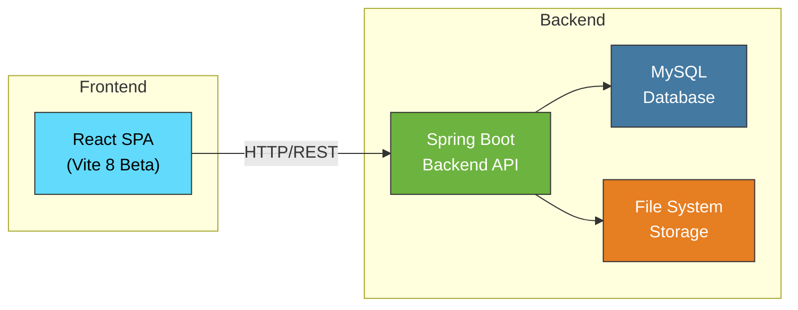
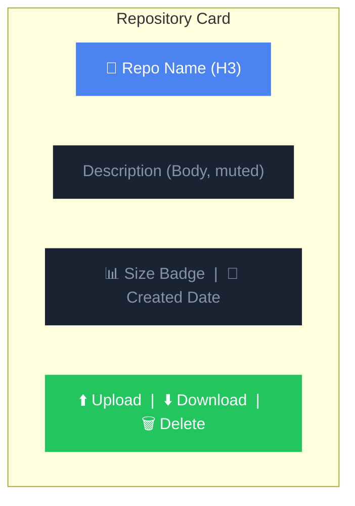
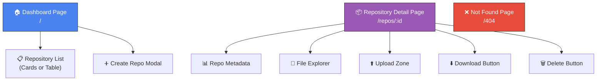
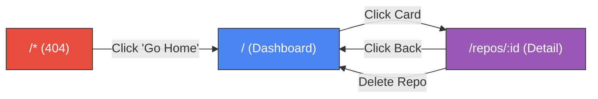
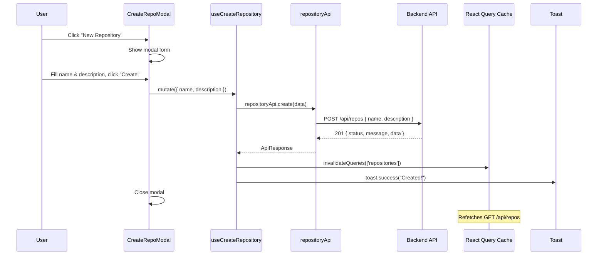
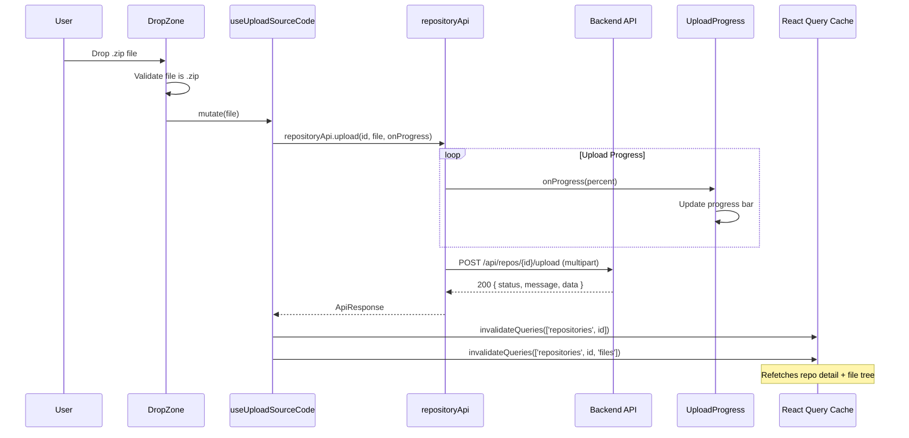
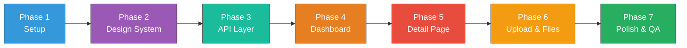

# 🖥️ CodeVault Frontend — Project Plan

> **Project**: CodeVault UI – Frontend for Source Code Storage Server  
> **Version**: 1.0 (Connects to CodeVault Backend v1.0)  
> **Date**: 2026-03-03  
> **Status**: Planning Phase  
> **Stack**: React + Vite 8 Beta + JavaScript  

---

## Table of Contents

1. [Project Overview & Objectives](#1-project-overview--objectives)
2. [Scope & Key Features](#2-scope--key-features)
3. [Frameworks & Technologies](#3-frameworks--technologies)
4. [Project Initialization](#4-project-initialization)
5. [Project Structure](#5-project-structure)
6. [Design System & UI Guidelines](#6-design-system--ui-guidelines)
7. [Page & Component Design](#7-page--component-design)
8. [Routing Architecture](#8-routing-architecture)
9. [API Integration Layer](#9-api-integration-layer)
10. [State Management](#10-state-management)
11. [Workflow & Data Flow](#11-workflow--data-flow)
12. [Responsive Design Strategy](#12-responsive-design-strategy)
13. [Development Workflow & Phases](#13-development-workflow--phases)
14. [Testing Strategy](#14-testing-strategy)
15. [Build & Deployment](#15-build--deployment)
16. [Future Extensibility](#16-future-extensibility)

---

## 1. Project Overview & Objectives

### 1.1 What is CodeVault UI?

CodeVault UI is the **frontend web application** that provides a rich, modern interface for interacting with the CodeVault backend API. It enables users to manage source code repositories — create, browse, upload ZIP archives, download, and explore file structures — all through an intuitive, visually premium web experience.

### 1.2 Main Objectives

| # | Objective | Description |
|---|-----------|-------------|
| 1 | **Repository Dashboard** | Display all repositories in a beautiful card/table view with metadata |
| 2 | **Create Repository** | Provide a form/modal to create new repositories with name & description |
| 3 | **Repository Detail View** | Show detailed metadata and file tree for a specific repository |
| 4 | **ZIP Upload** | Drag-and-drop or file picker to upload `.zip` archives to a repository |
| 5 | **ZIP Download** | One-click download of a repository as a `.zip` archive |
| 6 | **File Explorer** | Interactive tree view of all files/directories within a repository |
| 7 | **Modern UX** | Premium, dark-mode-first design with glassmorphism, animations, and responsive layout |
| 8 | **Error Handling** | Graceful error states, toast notifications, and loading skeletons |

### 1.3 Explicit Exclusions (v1.0)

> [!IMPORTANT]
> The following features are **intentionally excluded** from v1.0:

- ❌ Authentication / Login / Registration (backend has no auth)
- ❌ User management / profiles
- ❌ Version history / commit viewing
- ❌ Code editor / syntax highlighting viewer
- ❌ Real-time collaboration features
- ❌ Mobile native app

---

## 2. Scope & Key Features

### 2.1 System Architecture (Frontend ↔ Backend)



### 2.2 Feature-to-API Mapping

| Frontend Feature | Backend API Endpoint | HTTP Method | Description |
|-----------------|---------------------|-------------|-------------|
| Repository Dashboard | `/api/repos` | `GET` | Fetch all repositories |
| Create Repository | `/api/repos` | `POST` | Create with name & description |
| Repository Detail | `/api/repos/{id}` | `GET` | Fetch single repository metadata |
| Delete Repository | `/api/repos/{id}` | `DELETE` | Remove repository |
| Upload Source Code | `/api/repos/{id}/upload` | `POST` | Upload ZIP file (multipart) |
| Download Repository | `/api/repos/{id}/download` | `GET` | Download as ZIP stream |
| File Explorer | `/api/repos/{id}/files` | `GET` | List repository file tree |

---

## 3. Frameworks & Technologies

### 3.1 Core Stack

| Category | Technology | Version | Purpose |
|----------|-----------|---------|---------|
| **Runtime** | Node.js | 22.x LTS | JavaScript runtime |
| **Build Tool** | Vite | 8.x Beta | Next-gen build tool with HMR |
| **UI Library** | React | 19.x | Component-based UI |
| **Language** | JavaScript | ES2024+ | Application logic |
| **Routing** | React Router | 7.x | Client-side routing |
| **HTTP Client** | Axios | 1.x | API communication |
| **State/Caching** | TanStack Query (React Query) | 5.x | Server state management & caching |
| **Styling** | Vanilla CSS + CSS Modules | — | Scoped, maintainable styles |
| **Icons** | Lucide React | Latest | Beautiful, consistent icon set |
| **Notifications** | React Hot Toast | Latest | Toast notification system |

### 3.2 Dev Dependencies

| Tool | Purpose |
|------|---------|
| **ESLint** | Code linting |
| **Prettier** | Code formatting |
| **Vitest** | Unit testing (Vite-native) |
| **Testing Library** | Component testing |

---

## 4. Project Initialization

### 4.1 Create Vite Project (Vite 8 Beta)

```bash
# Navigate to project root (or create separately)
npx -y create-vite@latest codevault-fe --template react

# Enter project directory
cd codevault-fe

# Install dependencies
npm install
```

> [!NOTE]
> Vite 8 Beta is experimental. The `create-vite@latest` command will use the latest available version. If Vite 8 beta requires a specific channel, use:
> ```bash
> npx -y create-vite@beta codevault-fe --template react
> ```

### 4.2 Install Additional Dependencies

```bash
# Core dependencies
npm install react-router-dom@latest axios @tanstack/react-query lucide-react react-hot-toast

# Dev dependencies
npm install -D @tanstack/react-query-devtools
```

### 4.3 Vite Configuration

```javascript
// vite.config.js
import { defineConfig } from 'vite'
import react from '@vitejs/plugin-react'

export default defineConfig({
  plugins: [react()],
  server: {
    port: 5173,
    proxy: {
      '/api': {
        target: 'http://localhost:8080',
        changeOrigin: true,
        secure: false,
      },
    },
  },
  resolve: {
    alias: {
      '@': '/src',
    },
  },
})
```

> [!TIP]
> The proxy configuration routes all `/api/*` requests to the Spring Boot backend at `localhost:8080`, avoiding CORS issues during development.

---

## 5. Project Structure

### 5.1 Folder & File Layout

```
codevault-fe/
├── index.html                          # Entry HTML
├── vite.config.js                      # Vite configuration
├── package.json
├── .env                                # Environment variables
├── .env.development                    # Dev-specific env
├── .env.production                     # Production env
│
├── public/
│   └── favicon.svg                     # App favicon
│
└── src/
    ├── main.jsx                        # React entry point
    ├── App.jsx                         # Root component with routing
    ├── App.css                         # Global app styles
    ├── index.css                       # CSS reset & design tokens
    │
    ├── api/                            # API service layer
    │   ├── axiosClient.js              # Axios instance with base config
    │   └── repositoryApi.js            # Repository endpoint functions
    │
    ├── components/                     # Reusable UI components
    │   ├── layout/
    │   │   ├── Header.jsx              # Top navigation bar
    │   │   ├── Header.module.css
    │   │   ├── Sidebar.jsx             # Optional side navigation
    │   │   ├── Sidebar.module.css
    │   │   ├── Layout.jsx              # Page layout wrapper
    │   │   └── Layout.module.css
    │   │
    │   ├── common/
    │   │   ├── Button.jsx              # Reusable button component
    │   │   ├── Button.module.css
    │   │   ├── Modal.jsx               # Modal dialog component
    │   │   ├── Modal.module.css
    │   │   ├── LoadingSkeleton.jsx      # Skeleton loading placeholders
    │   │   ├── LoadingSkeleton.module.css
    │   │   ├── EmptyState.jsx           # Empty state illustration
    │   │   ├── EmptyState.module.css
    │   │   ├── SearchBar.jsx            # Search/filter input
    │   │   ├── SearchBar.module.css
    │   │   ├── Badge.jsx                # Status/size badges
    │   │   └── Badge.module.css
    │   │
    │   ├── repository/
    │   │   ├── RepoCard.jsx             # Repository card for dashboard
    │   │   ├── RepoCard.module.css
    │   │   ├── RepoList.jsx             # Table/list view of repos
    │   │   ├── RepoList.module.css
    │   │   ├── CreateRepoModal.jsx      # Create repository modal/form
    │   │   ├── CreateRepoModal.module.css
    │   │   ├── DeleteRepoDialog.jsx     # Delete confirmation dialog
    │   │   └── DeleteRepoDialog.module.css
    │   │
    │   ├── upload/
    │   │   ├── DropZone.jsx             # Drag-and-drop upload area
    │   │   ├── DropZone.module.css
    │   │   ├── UploadProgress.jsx       # Upload progress indicator
    │   │   └── UploadProgress.module.css
    │   │
    │   └── file-explorer/
    │       ├── FileTree.jsx             # Recursive file tree component
    │       ├── FileTree.module.css
    │       ├── FileTreeItem.jsx         # Single file/folder row
    │       └── FileTreeItem.module.css
    │
    ├── pages/                           # Route-level page components
    │   ├── DashboardPage.jsx            # Home — all repositories
    │   ├── DashboardPage.module.css
    │   ├── RepositoryDetailPage.jsx     # Single repo detail + files
    │   ├── RepositoryDetailPage.module.css
    │   ├── NotFoundPage.jsx             # 404 page
    │   └── NotFoundPage.module.css
    │
    ├── hooks/                           # Custom React hooks
    │   ├── useRepositories.js           # Fetch all repos (React Query)
    │   ├── useRepository.js             # Fetch single repo (React Query)
    │   ├── useCreateRepository.js       # Create mutation
    │   ├── useDeleteRepository.js       # Delete mutation
    │   ├── useUploadSourceCode.js       # Upload mutation with progress
    │   ├── useRepositoryFiles.js        # Fetch file tree
    │   └── useDownloadRepository.js     # Download trigger
    │
    ├── utils/                           # Utility functions
    │   ├── formatBytes.js               # Format bytes to KB/MB/GB
    │   ├── formatDate.js                # Format ISO dates
    │   └── constants.js                 # App-wide constants
    │
    └── assets/                          # Static assets
        ├── logo.svg                     # CodeVault logo
        └── empty-state.svg             # Empty state illustration
```

### 5.2 Layer Responsibility Matrix

| Layer | Directory | Responsibility |
|-------|-----------|---------------|
| **Pages** | `pages/` | Route-level views, compose components, minimal logic |
| **Components** | `components/` | Reusable, presentational UI pieces |
| **Hooks** | `hooks/` | Data fetching, mutations, side effects (React Query) |
| **API** | `api/` | HTTP client, endpoint definitions, request/response mapping |
| **Utils** | `utils/` | Pure utility functions (formatting, constants) |
| **Assets** | `assets/` | Static files (SVGs, images) |
| **Styles** | `*.module.css` | Scoped CSS Modules per component |

---

## 6. Design System & UI Guidelines

### 6.1 Design Philosophy

> **Dark-mode first, glassmorphism-inspired, premium feel.**

The design should evoke a developer tool aesthetic — think **GitHub Dark**, **Linear**, or **Vercel Dashboard** — with smooth animations, subtle glass effects, and a harmonious color palette.

### 6.2 Color Palette

```css
/* Design Tokens — index.css */
:root {
  /* ── Background ── */
  --bg-primary:       hsl(222, 47%, 6%);       /* #0a0e1a — Deep navy-black */
  --bg-secondary:     hsl(222, 40%, 10%);      /* #101828 — Card backgrounds */
  --bg-tertiary:      hsl(222, 35%, 14%);      /* #171f33 — Elevated surfaces */
  --bg-glass:         hsla(222, 40%, 15%, 0.6); /* Glass effect base */

  /* ── Text ── */
  --text-primary:     hsl(210, 40%, 96%);      /* #eef2f9 — Primary text */
  --text-secondary:   hsl(215, 20%, 58%);      /* #8494a7 — Secondary text */
  --text-muted:       hsl(215, 15%, 40%);      /* #5a6577 — Muted/disabled */

  /* ── Accent ── */
  --accent-primary:   hsl(217, 91%, 60%);      /* #4B83F0 — Primary blue */
  --accent-hover:     hsl(217, 91%, 68%);      /* Hover state */
  --accent-glow:      hsla(217, 91%, 60%, 0.3); /* Glow effect */

  /* ── Semantic ── */
  --success:          hsl(142, 70%, 45%);      /* #22C55E — Green */
  --warning:          hsl(38, 92%, 50%);       /* #F59E0B — Amber */
  --danger:           hsl(0, 84%, 60%);        /* #EF4444 — Red */
  --info:             hsl(199, 89%, 48%);      /* #0EA5E9 — Cyan */

  /* ── Border ── */
  --border-default:   hsla(215, 20%, 30%, 0.4);
  --border-hover:     hsla(215, 20%, 50%, 0.5);

  /* ── Radius ── */
  --radius-sm:        6px;
  --radius-md:        10px;
  --radius-lg:        16px;
  --radius-xl:        24px;

  /* ── Shadows ── */
  --shadow-sm:        0 1px 2px hsla(0, 0%, 0%, 0.3);
  --shadow-md:        0 4px 12px hsla(0, 0%, 0%, 0.4);
  --shadow-lg:        0 8px 32px hsla(0, 0%, 0%, 0.5);
  --shadow-glow:      0 0 20px var(--accent-glow);

  /* ── Typography ── */
  --font-sans:        'Inter', 'Segoe UI', system-ui, -apple-system, sans-serif;
  --font-mono:        'JetBrains Mono', 'Fira Code', 'Consolas', monospace;

  /* ── Spacing ── */
  --space-xs:         4px;
  --space-sm:         8px;
  --space-md:         16px;
  --space-lg:         24px;
  --space-xl:         32px;
  --space-2xl:        48px;
  --space-3xl:        64px;

  /* ── Transitions ── */
  --transition-fast:  150ms cubic-bezier(0.4, 0, 0.2, 1);
  --transition-base:  250ms cubic-bezier(0.4, 0, 0.2, 1);
  --transition-slow:  400ms cubic-bezier(0.4, 0, 0.2, 1);
}
```

### 6.3 Typography

| Element | Font | Size | Weight |
|---------|------|------|--------|
| H1 (Page title) | Inter | 28px | 700 (Bold) |
| H2 (Section) | Inter | 22px | 600 (Semibold) |
| H3 (Card title) | Inter | 18px | 600 |
| Body | Inter | 14px | 400 (Regular) |
| Small / Caption | Inter | 12px | 400 |
| Code / Mono | JetBrains Mono | 13px | 400 |

### 6.4 Glassmorphism Card Style

```css
.glass-card {
  background: var(--bg-glass);
  backdrop-filter: blur(12px);
  -webkit-backdrop-filter: blur(12px);
  border: 1px solid var(--border-default);
  border-radius: var(--radius-lg);
  box-shadow: var(--shadow-md);
  transition: all var(--transition-base);
}

.glass-card:hover {
  border-color: var(--border-hover);
  box-shadow: var(--shadow-lg), var(--shadow-glow);
  transform: translateY(-2px);
}
```

### 6.5 Animation Guidelines

| Animation | CSS Property | Duration | Easing |
|-----------|-------------|----------|--------|
| Card hover lift | `transform, box-shadow` | 250ms | `ease-out` |
| Modal entrance | `opacity, transform (scale)` | 300ms | `cubic-bezier(0.16, 1, 0.3, 1)` |
| Page transition | `opacity` | 200ms | `ease-in-out` |
| Skeleton shimmer | `background-position` | 1.5s | `linear` (infinite) |
| Toast slide-in | `transform (translateX)` | 300ms | `spring-like` |
| File tree expand | `max-height, opacity` | 250ms | `ease-out` |
| Upload progress | `width` | continuous | `linear` |
| Button press | `transform (scale)` | 100ms | `ease-out` |

### 6.6 Component Visual Specifications



---

## 7. Page & Component Design

### 7.1 Pages Overview



### 7.2 Page 1: Dashboard Page (`/`)

**Purpose:** Home page displaying all repositories.

**Layout:**
```
┌─────────────────────────────────────────────────┐
│  🔒 CodeVault           [🔍 Search]  [➕ New Repo] │  ← Header
├─────────────────────────────────────────────────┤
│                                                   │
│  📦 Your Repositories (12)                        │  ← Section Title + Count
│                                                   │
│  ┌──────────┐  ┌──────────┐  ┌──────────┐       │
│  │ 📂 proj-1│  │ 📂 proj-2│  │ 📂 proj-3│       │  ← Repo Cards Grid
│  │ desc...  │  │ desc...  │  │ desc...  │       │
│  │ 2.4MB    │  │ 1.1MB    │  │ 540KB    │       │
│  │ Mar 1    │  │ Feb 28   │  │ Feb 25   │       │
│  └──────────┘  └──────────┘  └──────────┘       │
│                                                   │
│  ┌──────────┐  ┌──────────┐  ┌──────────┐       │
│  │ 📂 proj-4│  │ 📂 proj-5│  │ 📂 proj-6│       │
│  │ ...      │  │ ...      │  │ ...      │       │
│  └──────────┘  └──────────┘  └──────────┘       │
│                                                   │
└─────────────────────────────────────────────────┘
```

**Components Used:**
- `Header` — top bar with logo, search, and "New Repository" button
- `SearchBar` — filter repositories by name
- `RepoCard` — individual repository card (grid layout)
- `CreateRepoModal` — modal form triggered by "New Repository" button
- `LoadingSkeleton` — shown while fetching repos
- `EmptyState` — shown when no repositories exist

**Data Source:** `GET /api/repos`

**Interactions:**
| Action | Result |
|--------|--------|
| Click "New Repository" | Opens `CreateRepoModal` |
| Click a `RepoCard` | Navigate to `/repos/{id}` |
| Type in `SearchBar` | Filter cards by name (client-side) |
| Submit create form | `POST /api/repos` → refetch list → close modal + toast |

---

### 7.3 Page 2: Repository Detail Page (`/repos/:id`)

**Purpose:** Detailed view of a single repository with file explorer and upload/download capabilities.

**Layout:**
```
┌─────────────────────────────────────────────────┐
│  🔒 CodeVault           [← Back]                │  ← Header
├─────────────────────────────────────────────────┤
│                                                   │
│  📦 my-awesome-project                            │  ← Repo Name (H1)
│  A sample Spring Boot application                 │  ← Description
│                                                   │
│  ┌────────────────────────────────────────────┐  │
│  │ 📊 Size: 2.4 MB  │  📅 Created: Mar 1     │  │  ← Metadata Bar
│  │ 🔄 Updated: Mar 2 │  📁 Path: /repos/1    │  │
│  └────────────────────────────────────────────┘  │
│                                                   │
│  ┌─── Actions ──────────────────────────────────┐│
│  │ [⬆️ Upload ZIP]  [⬇️ Download ZIP] [🗑️ Del]  ││  ← Action Buttons
│  └──────────────────────────────────────────────┘│
│                                                   │
│  ┌─── Upload Zone (if uploading) ───────────────┐│
│  │  ┌──────────────────────────────────────┐    ││
│  │  │     📁 Drag & drop your .zip here     │    ││  ← DropZone
│  │  │        or click to browse             │    ││
│  │  └──────────────────────────────────────┘    ││
│  │  [████████████░░░░░░░░] 65% uploading...     ││  ← UploadProgress
│  └──────────────────────────────────────────────┘│
│                                                   │
│  📂 File Explorer                                 │
│  ┌──────────────────────────────────────────────┐│
│  │ ▶ 📁 src/                                     ││
│  │   ▶ 📁 main/                                  ││
│  │     ▶ 📁 java/                                ││
│  │       📄 Application.java                     ││  ← FileTree
│  │ 📄 pom.xml                                    ││
│  │ 📄 README.md                                  ││
│  └──────────────────────────────────────────────┘│
│                                                   │
└─────────────────────────────────────────────────┘
```

**Components Used:**
- `Header` — with back navigation
- Metadata display section (inline, no separate component needed)
- `Button` — Upload, Download, Delete actions
- `DropZone` — drag-and-drop ZIP upload area
- `UploadProgress` — progress bar during upload
- `FileTree` — recursive, collapsible file/directory tree
- `FileTreeItem` — individual tree node
- `DeleteRepoDialog` — confirmation modal before delete

**Data Sources:**
- `GET /api/repos/{id}` — repository metadata
- `GET /api/repos/{id}/files` — file tree data
- `POST /api/repos/{id}/upload` — upload action
- `GET /api/repos/{id}/download` — download action
- `DELETE /api/repos/{id}` — delete action

**Interactions:**
| Action | Result |
|--------|--------|
| Click "Upload ZIP" | Show/toggle `DropZone` |
| Drop file on `DropZone` | Validate `.zip` → `POST /upload` → show progress → refetch files + metadata |
| Click "Download ZIP" | Trigger `GET /download` → browser download |
| Click "Delete" | Opens `DeleteRepoDialog` → confirm → `DELETE /api/repos/{id}` → navigate to `/` |
| Click folder in `FileTree` | Expand/collapse children |
| Click "Back" | Navigate to `/` |

---

### 7.4 Page 3: Not Found Page (`/404`)

**Purpose:** Friendly 404 page for invalid routes.

**Content:**
- Large "404" display with gradient text
- "Page not found" message
- "Back to Dashboard" button
- Subtle floating animation

---

### 7.5 Component Specifications

#### Header

| Prop | Type | Description |
|------|------|-------------|
| — | — | Static component, uses routing internally |

**Elements:**
- Logo + "CodeVault" brand text (left)
- Navigation (if applicable, future)
- "New Repository" button (right, dashboard only)
- Subtle bottom border glow

---

#### RepoCard

| Prop | Type | Description |
|------|------|-------------|
| `repository` | `Object` | Repository data `{ id, name, description, sizeInBytes, createdAt, updatedAt }` |
| `onClick` | `Function` | Navigate to detail page |

**Visual Elements:**
- Glassmorphism card with hover lift effect
- Folder icon + repo name (bold)
- Description (truncated to 2 lines)
- Size badge (formatted: "2.4 MB")
- Relative timestamp ("2 days ago")
- Subtle gradient border on hover

---

#### CreateRepoModal

| Prop | Type | Description |
|------|------|-------------|
| `isOpen` | `boolean` | Controls modal visibility |
| `onClose` | `Function` | Close handler |
| `onSuccess` | `Function` | Called after successful creation |

**Form Fields:**
- `name` — required, max 150 chars, with validation
- `description` — optional, textarea

---

#### DropZone

| Prop | Type | Description |
|------|------|-------------|
| `onFileDrop` | `Function(file)` | Callback when a ZIP file is dropped/selected |
| `isUploading` | `boolean` | Disable while uploading |

**Behavior:**
- Accepts only `.zip` files
- Visual feedback on drag-over (border glow, background change)
- File validation before calling `onFileDrop`
- Shows selected file name after selection

---

#### FileTree

| Prop | Type | Description |
|------|------|-------------|
| `files` | `Array` | Array of `{ name, type, path }` entries from API |

**Behavior:**
- Transforms flat file list into nested tree structure
- Directories are collapsible (toggle on click)
- Files show file-type icons (📄, 📁)
- Indentation for nesting depth
- Smooth expand/collapse animation

---

#### DeleteRepoDialog

| Prop | Type | Description |
|------|------|-------------|
| `isOpen` | `boolean` | Controls dialog visibility |
| `repositoryName` | `string` | Name shown in confirmation message |
| `onConfirm` | `Function` | Delete confirm callback |
| `onCancel` | `Function` | Cancel callback |

**Content:**
- Warning icon
- "Are you sure you want to delete **{name}**?"
- "This action cannot be undone. All files will be permanently removed."
- Cancel + Delete buttons (delete is red/danger)

---

## 8. Routing Architecture

### 8.1 Route Definitions

```javascript
// App.jsx — Route Configuration
import { BrowserRouter, Routes, Route } from 'react-router-dom';

const routes = [
  { path: '/',            element: <DashboardPage /> },
  { path: '/repos/:id',   element: <RepositoryDetailPage /> },
  { path: '*',            element: <NotFoundPage /> },
];
```

### 8.2 Route Table

| Path | Page Component | Data Required | Back Navigation |
|------|---------------|---------------|-----------------|
| `/` | `DashboardPage` | All repositories | — |
| `/repos/:id` | `RepositoryDetailPage` | Single repo + files | → `/` |
| `*` | `NotFoundPage` | — | → `/` |

### 8.3 Navigation Flow



---

## 9. API Integration Layer

### 9.1 Axios Client Setup

```javascript
// src/api/axiosClient.js
import axios from 'axios';

const axiosClient = axios.create({
  baseURL: import.meta.env.VITE_API_BASE_URL || '/api',
  timeout: 30000,
  headers: {
    'Content-Type': 'application/json',
  },
});

// ── Response Interceptor ──
axiosClient.interceptors.response.use(
  (response) => response.data, // Unwrap to ApiResponse directly
  (error) => {
    const message = error.response?.data?.message || 'An unexpected error occurred';
    return Promise.reject({ status: error.response?.status, message });
  }
);

export default axiosClient;
```

### 9.2 Repository API Functions

```javascript
// src/api/repositoryApi.js
import axiosClient from './axiosClient';

export const repositoryApi = {

  // GET /api/repos — List all repositories
  getAll: () => axiosClient.get('/repos'),

  // GET /api/repos/:id — Get single repository
  getById: (id) => axiosClient.get(`/repos/${id}`),

  // POST /api/repos — Create repository
  create: (data) => axiosClient.post('/repos', data),

  // DELETE /api/repos/:id — Delete repository
  delete: (id) => axiosClient.delete(`/repos/${id}`),

  // POST /api/repos/:id/upload — Upload ZIP
  upload: (id, file, onProgress) => {
    const formData = new FormData();
    formData.append('file', file);
    return axiosClient.post(`/repos/${id}/upload`, formData, {
      headers: { 'Content-Type': 'multipart/form-data' },
      onUploadProgress: (event) => {
        const percent = Math.round((event.loaded * 100) / event.total);
        onProgress?.(percent);
      },
    });
  },

  // GET /api/repos/:id/download — Download as ZIP
  download: (id) => axiosClient.get(`/repos/${id}/download`, {
    responseType: 'blob',
  }),

  // GET /api/repos/:id/files — List files
  getFiles: (id) => axiosClient.get(`/repos/${id}/files`),
};
```

### 9.3 Backend Response Mapping

The backend wraps all responses in `ApiResponse<T>`:

```json
{
  "status": 200,
  "message": "Success",
  "data": { /* payload */ }
}
```

The Axios interceptor unwraps this, so hooks/components receive the full `ApiResponse` object. Access the payload via `.data`.

### 9.4 Environment Variables

```bash
# .env.development
VITE_API_BASE_URL=/api

# .env.production
VITE_API_BASE_URL=https://api.codevault.dev/api
```

---

## 10. State Management

### 10.1 Strategy: TanStack Query (React Query)

> [!TIP]
> Server state (data from API) is managed by **React Query**. Local UI state (modals, search input) is managed by React's `useState`/`useReducer`. This avoids Redux/Zustand overhead for v1.0.

### 10.2 Query Keys Convention

```javascript
// Consistent, predictable cache keys
const queryKeys = {
  repositories: {
    all:    ['repositories'],
    detail: (id) => ['repositories', id],
    files:  (id) => ['repositories', id, 'files'],
  },
};
```

### 10.3 Custom Hooks

```javascript
// src/hooks/useRepositories.js
import { useQuery } from '@tanstack/react-query';
import { repositoryApi } from '../api/repositoryApi';

export function useRepositories() {
  return useQuery({
    queryKey: ['repositories'],
    queryFn: repositoryApi.getAll,
    select: (response) => response.data, // Unwrap ApiResponse.data
    staleTime: 30_000, // 30 seconds
  });
}
```

```javascript
// src/hooks/useRepository.js
import { useQuery } from '@tanstack/react-query';
import { repositoryApi } from '../api/repositoryApi';

export function useRepository(id) {
  return useQuery({
    queryKey: ['repositories', id],
    queryFn: () => repositoryApi.getById(id),
    select: (response) => response.data,
    enabled: !!id,
  });
}
```

```javascript
// src/hooks/useCreateRepository.js
import { useMutation, useQueryClient } from '@tanstack/react-query';
import { repositoryApi } from '../api/repositoryApi';
import toast from 'react-hot-toast';

export function useCreateRepository() {
  const queryClient = useQueryClient();

  return useMutation({
    mutationFn: (data) => repositoryApi.create(data),
    onSuccess: () => {
      queryClient.invalidateQueries({ queryKey: ['repositories'] });
      toast.success('Repository created successfully!');
    },
    onError: (error) => {
      toast.error(error.message || 'Failed to create repository');
    },
  });
}
```

```javascript
// src/hooks/useDeleteRepository.js
import { useMutation, useQueryClient } from '@tanstack/react-query';
import { repositoryApi } from '../api/repositoryApi';
import toast from 'react-hot-toast';

export function useDeleteRepository() {
  const queryClient = useQueryClient();

  return useMutation({
    mutationFn: (id) => repositoryApi.delete(id),
    onSuccess: () => {
      queryClient.invalidateQueries({ queryKey: ['repositories'] });
      toast.success('Repository deleted successfully');
    },
    onError: (error) => {
      toast.error(error.message || 'Failed to delete repository');
    },
  });
}
```

```javascript
// src/hooks/useUploadSourceCode.js
import { useMutation, useQueryClient } from '@tanstack/react-query';
import { repositoryApi } from '../api/repositoryApi';
import { useState } from 'react';
import toast from 'react-hot-toast';

export function useUploadSourceCode(repoId) {
  const queryClient = useQueryClient();
  const [progress, setProgress] = useState(0);

  const mutation = useMutation({
    mutationFn: (file) => repositoryApi.upload(repoId, file, setProgress),
    onSuccess: () => {
      queryClient.invalidateQueries({ queryKey: ['repositories', repoId] });
      queryClient.invalidateQueries({ queryKey: ['repositories', repoId, 'files'] });
      toast.success('Source code uploaded successfully!');
      setProgress(0);
    },
    onError: (error) => {
      toast.error(error.message || 'Upload failed');
      setProgress(0);
    },
  });

  return { ...mutation, progress };
}
```

```javascript
// src/hooks/useRepositoryFiles.js
import { useQuery } from '@tanstack/react-query';
import { repositoryApi } from '../api/repositoryApi';

export function useRepositoryFiles(id) {
  return useQuery({
    queryKey: ['repositories', id, 'files'],
    queryFn: () => repositoryApi.getFiles(id),
    select: (response) => response.data,
    enabled: !!id,
  });
}
```

```javascript
// src/hooks/useDownloadRepository.js
import { repositoryApi } from '../api/repositoryApi';
import toast from 'react-hot-toast';

export function useDownloadRepository() {
  const download = async (id, fileName) => {
    try {
      const blob = await repositoryApi.download(id);
      const url = window.URL.createObjectURL(blob);
      const link = document.createElement('a');
      link.href = url;
      link.download = `${fileName}.zip`;
      document.body.appendChild(link);
      link.click();
      link.remove();
      window.URL.revokeObjectURL(url);
      toast.success('Download started!');
    } catch (error) {
      toast.error('Failed to download repository');
    }
  };

  return { download };
}
```

### 10.4 State Type Summary

| State Type | Managed By | Examples |
|-----------|-----------|---------|
| **Server State** | React Query | Repository list, repo details, file tree |
| **UI State** | `useState` | Modal open/closed, search input, upload progress |
| **Navigation State** | React Router | Current route, route params (`:id`) |
| **Notification State** | React Hot Toast | Success/error/info toasts |

---

## 11. Workflow & Data Flow

### 11.1 Create Repository Flow



### 11.2 Upload Source Code Flow



### 11.3 File Tree Data Transformation

The backend returns a **flat list** of file entries:

```json
[
  { "name": "src",              "type": "directory", "path": "src" },
  { "name": "main",             "type": "directory", "path": "src/main" },
  { "name": "Application.java", "type": "file",      "path": "src/main/Application.java" },
  { "name": "pom.xml",          "type": "file",      "path": "pom.xml" }
]
```

The `FileTree` component transforms this into a **nested tree** for rendering:

```javascript
// utils/buildFileTree.js
export function buildFileTree(files) {
  const root = { name: 'root', type: 'directory', children: [] };
  
  files
    .sort((a, b) => {
      // Directories first, then alphabetical
      if (a.type !== b.type) return a.type === 'directory' ? -1 : 1;
      return a.path.localeCompare(b.path);
    })
    .forEach(file => {
      const parts = file.path.split('/');
      let current = root;
      
      parts.forEach((part, index) => {
        let child = current.children?.find(c => c.name === part);
        if (!child) {
          child = {
            name: part,
            type: index === parts.length - 1 ? file.type : 'directory',
            path: parts.slice(0, index + 1).join('/'),
            children: [],
          };
          current.children.push(child);
        }
        current = child;
      });
    });
  
  return root.children;
}
```

---

## 12. Responsive Design Strategy

### 12.1 Breakpoints

| Breakpoint | Width | Target |
|-----------|-------|--------|
| **Mobile** | `< 640px` | Phones |
| **Tablet** | `640px – 1024px` | Tablets, small laptops |
| **Desktop** | `1024px – 1440px` | Laptops, monitors |
| **Wide** | `> 1440px` | Ultra-wide monitors |

### 12.2 Layout Adaptations

| Component | Mobile | Tablet | Desktop |
|-----------|--------|--------|---------|
| **Header** | Logo + hamburger menu | Full header | Full header |
| **Repo Cards** | 1 column | 2 columns | 3 columns |
| **Detail Page** | Stacked layout | Stacked layout | Side-by-side (meta + files) |
| **File Tree** | Full width | Full width | 60% width panel |
| **DropZone** | Compact | Full | Full |
| **Actions** | Icon buttons | Icon + label | Full buttons |

### 12.3 CSS Grid for Dashboard

```css
.repo-grid {
  display: grid;
  grid-template-columns: repeat(auto-fill, minmax(320px, 1fr));
  gap: var(--space-lg);
  padding: var(--space-lg);
}

@media (max-width: 640px) {
  .repo-grid {
    grid-template-columns: 1fr;
    padding: var(--space-md);
  }
}
```

---

## 13. Development Workflow & Phases

### 13.1 Development Flow



### Phase 1: Project Setup (Day 1)

- [ ] Initialize Vite 8 Beta project with React template
- [ ] Install all dependencies (React Router, Axios, React Query, Lucide, Hot Toast)
- [ ] Configure `vite.config.js` (proxy, aliases)
- [ ] Set up `.env` files
- [ ] Configure ESLint + Prettier
- [ ] Create folder structure (`api/`, `components/`, `pages/`, `hooks/`, `utils/`)
- [ ] Verify dev server starts with `npm run dev`

### Phase 2: Design System & Global Styles (Day 1–2)

- [ ] Create `index.css` with CSS reset and all design tokens (colors, spacing, typography)
- [ ] Import Google Fonts (Inter, JetBrains Mono)
- [ ] Build base component styles (`.glass-card`, button variants, input styles)
- [ ] Create `Layout.jsx` with header structure
- [ ] Create `Header.jsx` with logo and navigation
- [ ] Build `Button.jsx` with variants (primary, secondary, danger, ghost)
- [ ] Build `Modal.jsx` reusable component
- [ ] Build `LoadingSkeleton.jsx` with shimmer animation
- [ ] Build `Badge.jsx` for status/size display
- [ ] Build `EmptyState.jsx` for zero-data scenarios

### Phase 3: API Layer & Hooks (Day 2–3)

- [ ] Create `axiosClient.js` with interceptors
- [ ] Create `repositoryApi.js` with all 7 endpoint functions
- [ ] Set up React Query provider in `main.jsx`
- [ ] Build `useRepositories.js` hook
- [ ] Build `useRepository.js` hook
- [ ] Build `useCreateRepository.js` hook
- [ ] Build `useDeleteRepository.js` hook
- [ ] Build `useUploadSourceCode.js` hook (with progress tracking)
- [ ] Build `useRepositoryFiles.js` hook
- [ ] Build `useDownloadRepository.js` hook
- [ ] Create utility functions (`formatBytes.js`, `formatDate.js`)
- [ ] Test API calls against running backend

### Phase 4: Dashboard Page (Day 3–4)

- [ ] Create `DashboardPage.jsx` with repo grid layout
- [ ] Build `RepoCard.jsx` with glassmorphism styling and hover effects
- [ ] Build `SearchBar.jsx` with client-side filtering
- [ ] Build `CreateRepoModal.jsx` with form validation
- [ ] Connect data fetching via `useRepositories` hook
- [ ] Connect create mutation via `useCreateRepository` hook
- [ ] Add toast notifications for create success/error
- [ ] Add loading skeletons during data fetch
- [ ] Add empty state when no repos exist
- [ ] Style the complete dashboard

### Phase 5: Repository Detail Page (Day 4–5)

- [ ] Create `RepositoryDetailPage.jsx` with metadata display
- [ ] Implement back navigation to dashboard
- [ ] Add Download button with `useDownloadRepository` hook
- [ ] Build `DeleteRepoDialog.jsx` with confirmation flow
- [ ] Connect delete mutation via `useDeleteRepository` hook
- [ ] Style metadata section with cards/badges
- [ ] Navigate to dashboard on successful delete

### Phase 6: Upload & File Explorer (Day 5–6)

- [ ] Build `DropZone.jsx` with drag-and-drop functionality
- [ ] Build `UploadProgress.jsx` with animated progress bar
- [ ] Connect upload mutation via `useUploadSourceCode` hook
- [ ] Implement `buildFileTree.js` utility (flat → nested transformation)
- [ ] Build `FileTree.jsx` recursive component
- [ ] Build `FileTreeItem.jsx` with expand/collapse animation
- [ ] Add file-type icons (folder, code file, config, etc.)
- [ ] Connect file listing via `useRepositoryFiles` hook
- [ ] Auto-refresh file tree after upload

### Phase 7: Polish, QA & Deploy (Day 6–7)

- [ ] Build `NotFoundPage.jsx` with creative 404 design
- [ ] Set up React Router with all routes in `App.jsx`
- [ ] Add page transition animations
- [ ] Responsive testing across breakpoints
- [ ] Cross-browser testing (Chrome, Firefox, Edge)
- [ ] Performance audit (bundle size, lazy loading)
- [ ] Add `<title>` and meta tags for SEO
- [ ] Final visual review and micro-animation polish
- [ ] Build production bundle and test
- [ ] Update README with frontend setup instructions

---

## 14. Testing Strategy

### 14.1 Testing Tools

| Tool | Purpose | Scope |
|------|---------|-------|
| **Vitest** | Unit testing (Vite-native, fast) | Utils, hooks, API functions |
| **React Testing Library** | Component testing | Components, pages |
| **MSW (Mock Service Worker)** | API mocking for tests | Integration testing |

### 14.2 Test Coverage Plan

| Layer | What to Test | Priority |
|-------|-------------|----------|
| **Utils** | `formatBytes`, `formatDate`, `buildFileTree` | High |
| **API** | Axios interceptors, API function signatures | Medium |
| **Hooks** | Mutation behavior, cache invalidation | Medium |
| **Components** | Rendering, user interactions, form validation | High |
| **Pages** | Full page flows (create, upload, delete) | High |

### 14.3 Key Test Scenarios

| Scenario | Expected Result |
|----------|----------------|
| Dashboard renders repos | All repo cards displayed |
| Search filters repos | Only matching repos shown |
| Create repo (valid) | Modal closes, toast success, list refreshes |
| Create repo (duplicate name) | Error toast, modal stays open |
| Upload valid ZIP | Progress bar completes, file tree refreshes |
| Upload non-ZIP | Error toast, no upload |
| Download repo | Browser triggers file download |
| Delete repo (confirm) | Navigate to dashboard, toast success |
| Delete repo (cancel) | Dialog closes, no action |
| 404 page | Shows not found message with home link |

---

## 15. Build & Deployment

### 15.1 Build Commands

```bash
# Development (with HMR)
npm run dev

# Production build
npm run build

# Preview production build
npm run preview
```

### 15.2 Production Build Output

```
dist/
├── index.html
├── assets/
│   ├── index-[hash].js      # Bundled JS
│   ├── index-[hash].css     # Bundled CSS
│   └── ...                  # Static assets
```

### 15.3 Deployment Options

| Option | Description | Setup |
|--------|-------------|-------|
| **Nginx** (Recommended) | Serve `dist/` + proxy `/api` to backend | `nginx.conf` with `try_files` + `proxy_pass` |
| **Docker** | Containerized with Nginx | Multi-stage Dockerfile (build → serve) |
| **Docker Compose** | Add as service alongside existing backend | New `codevault-fe` service |
| **Vercel / Netlify** | Managed hosting | Connect Git repo, set `VITE_API_BASE_URL` |

### 15.4 Docker Integration (Recommended)

```dockerfile
# Dockerfile.frontend
FROM node:22-alpine AS build
WORKDIR /app
COPY package*.json ./
RUN npm ci
COPY . .
RUN npm run build

FROM nginx:alpine
COPY --from=build /app/dist /usr/share/nginx/html
COPY nginx.conf /etc/nginx/conf.d/default.conf
EXPOSE 80
CMD ["nginx", "-g", "daemon off;"]
```

```nginx
# nginx.conf
server {
    listen 80;
    server_name localhost;
    root /usr/share/nginx/html;
    index index.html;

    # SPA fallback
    location / {
        try_files $uri $uri/ /index.html;
    }

    # Proxy API requests to backend
    location /api/ {
        proxy_pass http://codevault-app:8080/api/;
        proxy_set_header Host $host;
        proxy_set_header X-Real-IP $remote_addr;
    }
}
```

### 15.5 Docker Compose Addition

```yaml
# Add to existing docker-compose.yml
  codevault-fe:
    build:
      context: ./codevault-fe
      dockerfile: Dockerfile
    container_name: codevault-fe
    restart: unless-stopped
    depends_on:
      - codevault-app
    ports:
      - "5173:80"
    networks:
      - codevault-network
```

---

## 16. Future Extensibility

### 16.1 Planned Enhancements (v2.0+)

| Version | Feature | Impact on Frontend |
|---------|---------|-------------------|
| **v2.0** | Authentication (JWT) | Login/Register pages, auth context, protected routes, token management |
| **v2.0** | User profiles | Profile page, avatar, user settings |
| **v3.0** | Version history | Version timeline component, diff viewer |
| **v3.0** | Code viewer | Syntax-highlighted file viewer (Monaco / CodeMirror) |
| **v4.0** | Git integration | Clone URL display, branch selector |
| **v5.0** | Real-time updates | WebSocket integration, live notifications |

### 16.2 Architecture Decisions Supporting Extensibility

| Decision | Future Benefit |
|----------|---------------|
| React Query for server state | Easy to add new data sources, caching, optimistic updates |
| CSS Modules for styling | Scoped styles prevent conflicts as app grows |
| API layer abstraction | Swap Axios for fetch, add auth headers globally |
| Custom hooks pattern | Reusable data logic, easy to add new endpoints |
| Component-based architecture | Compose new pages from existing components |
| Environment variables | Easy to configure for different deployment targets |

---

> [!NOTE]
> **This document serves as the single source of truth** for the CodeVault Frontend v1.0 development effort. It is designed to work seamlessly with the existing [plan_project.md](./plan_project.md) backend plan. Update this document as the UI requirements evolve.

---

*Document prepared: 2026-03-03 | Project: CodeVault Frontend v1.0*
